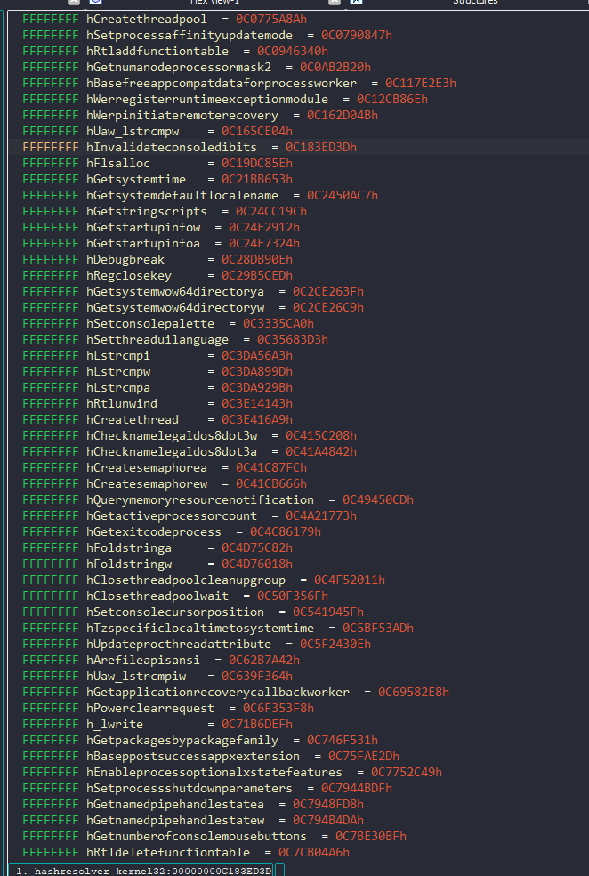

# 🔍 Hash Resolver

Resolve hashed API names by emulating the hashing function in-place using [Unicorn Engine](https://www.unicorn-engine.org/) + IDA integration.

Designed for reverse engineers dealing with obfuscated malware, shellcode, or custom loaders.

---

## ✨ Features

- Emulates real hashing functions via Unicorn
- Signature-based system with support for:
  - `cdecl`, `stdcall`, `fastcall`, `win64`
  - Arguments (incl. custom/default inputs)
  - Memory-return values
- CLI and IDA plugin support
- Supports `char*`, `uint32`, `uint64`, pointers, etc.

---

## 🚀 Quick Start

### Install as editable module:

```bash
pip install -e .
```

Make sure you're using the **same Python version** as IDA (e.g. Python 3.10)

**Use from CLI:**
1. Resolve hash to string (resolve mode):
```bash
python cli/main.py resolve \
    --signature <path_to_signature_file> \
    --funcbin <path_to_function_binary> \
    --hash <hash_value> \
    --symbols <path_to_symbols_file> \
    --arg <additional_argument_1=value> \
    --arg <additional_argument_2=value>
```

2. Calculate hash for specified string (hash mode):
```bash
python cli/main.py hash \
    --signature <path_to_signature_file> \
    --funcbin <path_to_function_binary> \
    --arg <additional_argument_1=value> \
    --arg <additional_argument_2=value>
```

3. Generate hash map in bulk for symbols list (bulk mode, emulator):
```bash
python cli/main.py bulk \
    --signature <path_to_signature_file> \
    --symbols <path_to_symbols_file> \
    --mode emu \
    --funcbin <path_to_function_binary> \
    --output <output_path> \
    --arg <additional_argument_1=value> \
    --arg <additional_argument_2=value>
```

4. Generate hash map in bulk for symbols list (bulk mode, runtime):
```bash
python cli/main.py bulk \
    --signature <path_to_signature_file> \
    --symbols <path_to_symbols_file> \
    --mode runtime \
    --exepath <path_to_exe_file> \
    --func-rva <function_rva> \
    --output <output_path> \
    --arg <additional_argument_1=value> \
    --arg <additional_argument_2=value>
```
- Replace the placeholders like `<path_to_signature_file>`, `<path_to_function_binary>`, etc., with the actual file paths and values for each mode.

**Integrate with IDA:**
- Symlink `ida_plugin/` into your `IDA/plugins/` directory as `hashres`
- Drop `hashres_plugin.py` next to it:
```bash
ln -s path/to/ida_plugin D:/Your/IDA/hashres
```
Then open a binary in IDA → right click a hash function → **Hash Resolver: Generate hashmap**


---



---

## 📖 Docs
- [Signature format](./ida_plugin/signatures/README.md)
- [IDA setup](./ida_plugin/README.md)

---

## 🧪 Testing
```bash
python -m pytest
```
CLI tests run in subprocesses to validate emulation

---

## 📎 License
MIT, do what you want.
