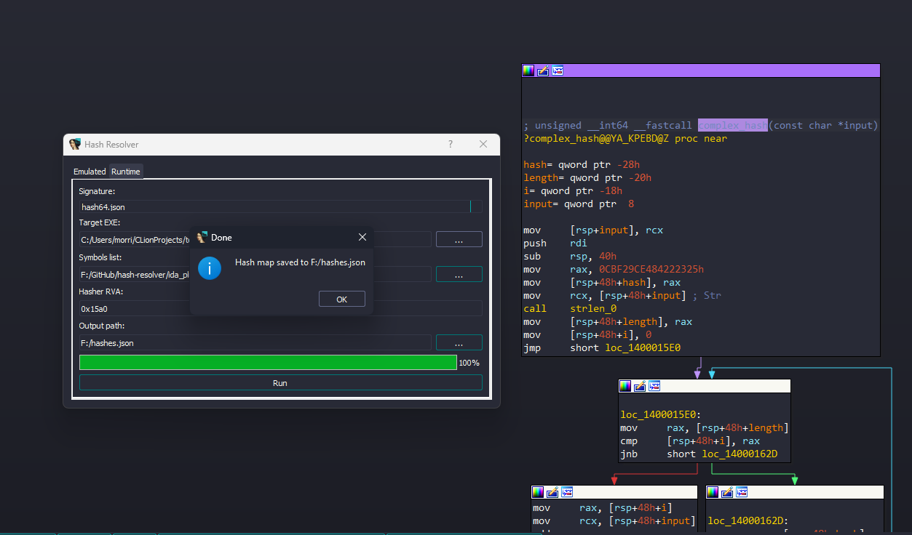

# 🔍 Hash Resolver

Resolve hashed API names by emulating the hashing function in-place using [Unicorn Engine](https://www.unicorn-engine.org/) + IDA integration.

Designed for reverse engineers dealing with obfuscated malware, shellcode, or custom loaders.

---

## ✨ Features

- Emulates real hashing functions via Unicorn
- Signature-based system with support for:
  - `cdecl`, `stdcall`, `fastcall`, `win64`
  - Arguments (incl. custom/default inputs)
  - Memory-return values
- CLI and IDA plugin support
- Supports `char*`, `uint32`, `uint64`, pointers, etc.

---

## 🚀 Quick Start

### Install as editable module:

```bash
pip install -e .
```

Make sure you're using the **same Python version** as IDA (e.g. Python 3.10)

**Use from CLI:**
```bash
python cli/main.py resolve \
    --signature ida_plugin/signatures/cdecl_hash32.json \
    --funcbin resources/cdecl_hash32.bin \
    --hash 0x53B2070F \
    --symbols ida_plugin/symbols/kernel32.txt
```

**Integrate with IDA:**
- Symlink `ida_plugin/` into your `IDA/plugins/` directory as `hashres`
- Drop `hashres_plugin.py` next to it:
```bash
ln -s path/to/ida_plugin D:/Your/IDA/hashres
```
Then open a binary in IDA → right click a hash function → **Resolve hash for this function**



---

## 📖 Docs
- [Signature format](./ida_plugin/signatures/README.md)
- [IDA setup](./ida_plugin/README.md)

---

## 🧪 Testing
```bash
python -m pytest
```
CLI tests run in subprocesses to validate emulation
---

## 📎 License
MIT, do what you want.
